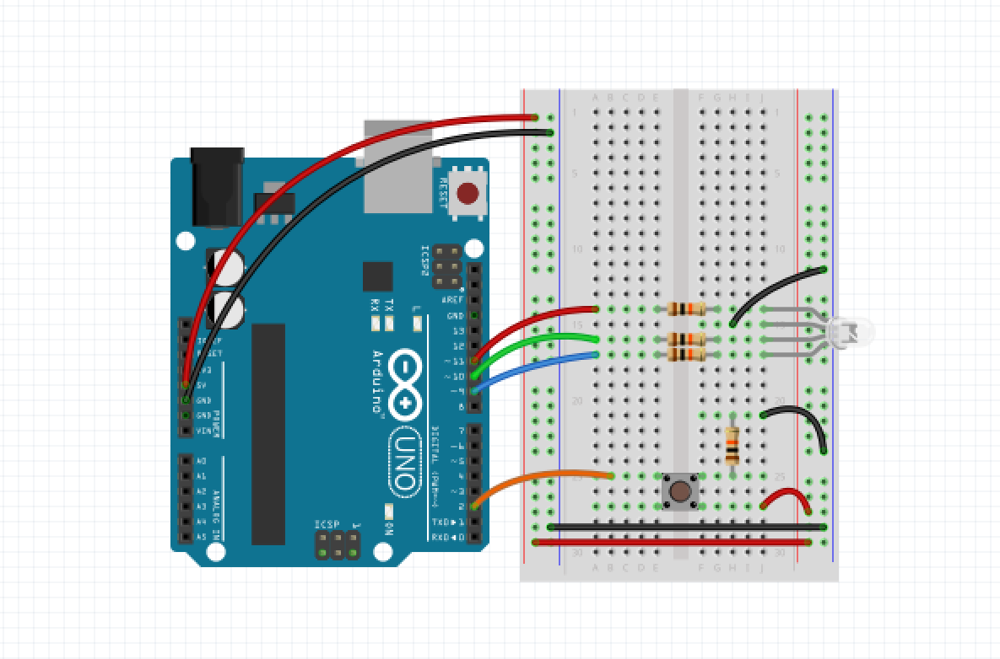

# ColorPicker
Simple Cinder app and paired [Arduino](https://www.arduino.cc/) sketch which communicate in both directions via serial. Once connected and the hardware pushbutton is pressed, the Cinder application will cycle through several animated color modes which will be mirrored on the hardware RGB LED.

A [Fritzing](http://fritzing.org/) sketch of the hardware wiring and components is included as _Arduino/Wiring Sketch.fzz_ and pictured below:

